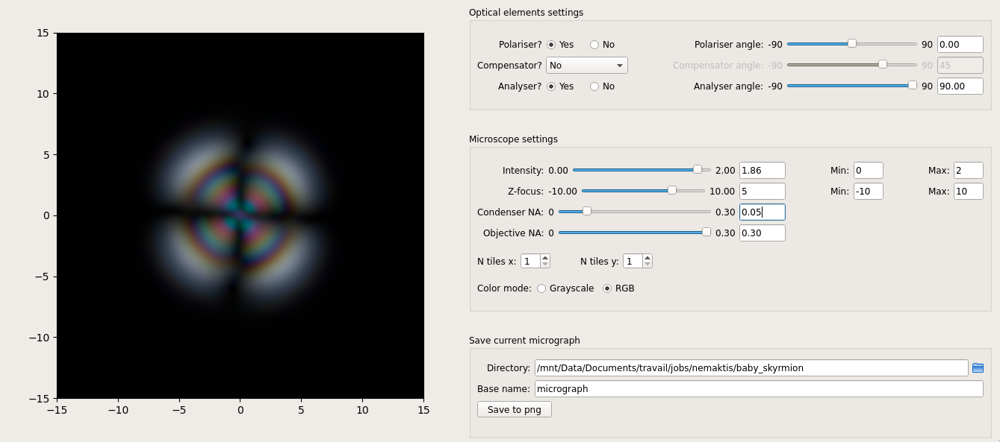

# Nemaktis

``Nemaktis`` is an open-source platform including tools for propagating and visualising optical field in
complex birefringent media such as liquid crystal (LC) layers. It includes three backends
implementing advanced numerical methods for light propagation, as well as an easy-to-use high
level interface in python allowing to quickly setup a simulation and visualize optical
micrographs of a LC structure as in a real microscope. 

## Quick introduction of the backends and python interface

The three backends implemented in ``nemaktis`` correspond to:

1. ``rt-solver``, a ray-tracing C++ code allowing to automatically represent optical fields in terms
   of ordinary and extraordinary rays (therefore being limited to uniaxial media). This module
   allows to propagate rays through any media with a sufficiently regular orientational field (i.e.
   with *C1* regularity). Optical fields can be reconstructed along rays or interpolated on a
   regular mesh using an advanced homotopy continuation algorithm. The main advantage of this
   scheme is the ability to access ray trajectories and get an intuitive feeling of how
   light is deflected by a liquid crystal structure, but can be inacurate when this
   structure is thick and/or has sharp features. For this reason, we advise to use this
   backend only for visualisation of light deflection, not for accurate simulation of
   optical field propagation (although in practice reasonable agreement can be obtained for simple
   structures, as explained in the Soft Matter paper cited below).

2. ``bpm-solver``, a beam propagation C++ code which simply propagates optical fields through any
   birefringent layers (no limitation on the regularity of the orientational field, although
   only paraxial components of the optical fields will be modeled accurately). This module
   relies on a novel operator-splitting scheme and accurate expressions of the operators for
   the beam walk-off, anisotropic diffraction, and phase evolution.  The main advantage of
   this scheme is its accuracy (1-5\% of relative error in comparison to a full resolution
   of Maxwell equations in a system with paraxial propagation) and efficiency (parallel
   implementation in C++ based on sparse matrices), as explained in the Optics Express paper
   cited below. This scheme is particularly well suited for efficient simulation of optical
   micrographs as in a real transmission micrographs.

3. ``dtmm``, a FFT-based diffractive transfer matrix python code which offer similar functionalities
   as ``bpm-solver`` but relies on a slightly less accurate scheme in its default version
   (although the accuracy can be improved at the cost of computational efficiency
   using a dedicated parameter). In most cases, this scheme will show similar accuracy as
   ``bpm-solver`` for micrograph simulations, and will in general be faster than
   ``bpm-solver`` on small meshes and slower on big meshes, as expected from the
   computational complexity of both methods (O(N) for ``bpm-solver``, O(N log[N]) for
   ``dtmm``). We also note that the underlying python library for ``dtmm`` offer a lot of
   advanced features (most notably the calculation of reflection) which are currently not
   implemented in the  ``bpm-solver`` backend. 

The high-level interface corresponds to a python package named ``nemaktis`` and allows to set-up
a director field for a LC sample (non-trivial shapes for the LC domain are supported), define
physics constant, propagate optical fields through the sample using either the ``bpm-solver``
or ``dtmm`` backend , and recombine them as in a real microscope to obtain polarised and
bright-field micrographs. A graphical user interface allows the user to quickly change settings
(focalisation, polariser angles...) while visualising optical micrographs in real-time.

Note that the ``rt-solver`` backend is not interfaced in the high-level python package and have to
be used directly. The reason for this is that the algorithm used to reconstruct fields is quite
complex and necessitates some tweaking from the user to get the best results. In order to keep
things simple in the high-level interface, we decided not to include ray-tracing support in
the python package at the moment.

The first two codes and the high-level interface were written by G. Poy and are hosted on this
repository, while the third code was written by A. Petelin is hosted in another
repository: <https://github.com/IJSComplexMatter/dtmm>.

## Installation

See the following page for installation instructions (you don't have to clone this repository
unless you want to modify the code):

<https://nemaktis.readthedocs.io/en/latest/intro/installation.html>

## Where to start?

If you are impatient, you can take a look at the [examples](HighLevelPythonInterface/examples)
folder to see basic usage of the high-level interface. Else, you can start reading the
documentation to learn the fine details of this software:

<https://nemaktis.readthedocs.io>

Note that the high-level interface does not give you access to the full range of features
offered by the backends. For example,  ``dtmm`` supports the calculation of reflected
fields, while in the high-level interface only forward-propagating fields are currently
supported. If you want to use such advanced features, you will have to learn how to use
directly the backends. The documentation of the backends is available in a dedicated section
of the nemaktis wiki (link above).

## License

``Nemaktis`` is released under the MIT license, so you can use it freely. You are strongly
encouraged to cite the following papers if you use this package for published research:

G. Poy, S. Žumer, Soft Matter **15**, 3659-3670 (2019).

G. Poy, S. Žumer, Optics Express, submitted (2020).

A. Petelin *et al.*, in preparation.
