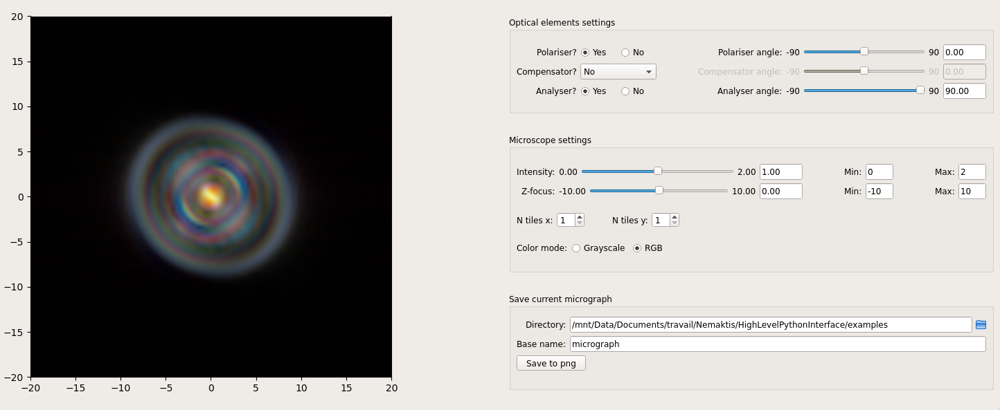

# Nemaktis

``Nemaktis`` is an open-source platform including tools for propagating and visualising optical field in
complex birefringent media such as liquid crystal (LC) layers. It includes three backends
implementing advanced numerical methods for light propagation, as well as an easy-to-use high
level interface in python allowing to quickly setup a simulation and visualize optical
micrographs of a LC structure as in a real microscope. 




## Quick introduction of the backends and python interface

The three backends implemented in ``nemaktis`` correspond to:

1. ``rt-solver``, a ray-tracing C++ code allowing to automatically represent optical fields in terms
   of ordinary and extraordinary rays (therefore being limited to uniaxial media). This module
   allows to propagate rays through any media with a sufficiently regular orientational field (i.e.
   with *C1* regularity). Optical fields can be reconstructed along rays or interpolated on a
   cartesian mesh using an advanced homotopy continuation algorithm. 

2. ``bpm-solver``, a beam propagation C++ code which simply propagates optical fields through any
   birefringent layers (no limitation on the regularity of the orientational field, although
   accurate results are expected only when the orientational fields vary over lengths greater than
   a few wavelengths). This module relies on a novel operator-splitting scheme and accurate
   expressions of the operators for the beam walk-off, anisotropic diffraction, and phase evolution.

3. ``dtmm``, a diffractive transfer matrix python code which offer similar functionalities as
   ``bpm-solver`` but relies on a less acurate scheme (the diffraction is assumed to be isotropic,
   and the beam walk-off is neglected). The main advantages of this backend is that it is
   incredibly well optimized (it allows to get results in far less time than with the other
   schemes) and that it supports advanced simulations (Köhler illumination setup, iterative
   scheme for reflections...).

The high-level interface corresponds to a python package named ``nemaktis`` and allows to set-up
a director field for a LC sample (non-trivial shapes for the LC domain are supported), define
physics constant, propagate optical fields through the sample using either the ``bpm-solver``
or ``dtmm`` backend , and recombine them as in a real microscope to obtain polarised and
bright-field micrographs. A graphical user interface allows the user to quickly change settings
(focalisation, polariser angles...) while visualising optical micrographs in real-time.

Note that the ``rt-solver`` backend is not interfaced in the high-level python package and have to
be used directly. The reason for this is that the algorithm used to reconstruct fields is quite
complex and necessitates some tweaking from the user to get the best results. In order to keep
things simple in the high-level interface, we decided not to include ray-tracing support in
the python package at the moment.

The first two codes and the high-level interface were written by G. Poy and are hosted on this
repository, while the third code was written by A. Petelin is hosted in [another
repository](https://github.com/IJSComplexMatter/dtmm).


## Installation

### Simple method (conda package, linux-64)

The simplest way of installing this package is through the *conda* package manager (no
compilation and no dependency to install manually). You just need a linux machine with conda
or miniconda installed on it (it should be available on the native package manager of your linux
distribution, if not see [Installing miniconda on
Linux](https://conda.io/projects/conda/en/latest/user-guide/install/linux.html)).

First, open a terminal and create a new environment for nemaktis (of course you can adjust the
name of this environment):
```
conda create -n nemaktis
```
Then, activate the environment and install the [``nemaktis`` package](https://anaconda.org/warthan07/nemaktis):
```
conda activate nemaktis
conda install -c warthan07 nemaktis
```

After this, all dependencies for nemaktis will be available in the environment you just
created, which means you just need to run ``conda activate nemaktis`` in any terminal
window to start using this package.


### Developper method (conda-build, linux-64)

If you want to be able to modify the code (perhaps you found a bug, or want to implement
yourselves a new feature), but still want to enjoy the simplicity of conda packages
(no relative paths to manage, everything works as with a system package), you can build 
yourselve the ``nemaktis`` package for linux:

1. Get the code of this repository (``git clone git@github.com:warthan07/Nemaktis.git``) and
   implements the changes that you want. For the C++ codes, compilation steps are provided
   in the subfolders [bpm-solver](BeamPropagationSolver) and [rt-solver](RayTracingSolver) if
   you want to test them locally (in which case you will have to install yourselves the
   dependencies listed in each CMakeLists).

2. In a terminal, go to the subfolder *conda_recipe* of this repository and activate any
   conda environment in which you have write access. If you don't have any conda environment
   yet, you can type:
   ```
   conda create -n build
   conda activate build
   ```
   If necessary, install the conda-build tools:
   ```
   conda install conda-build conda-verify
   ```

3. Run the following command, which will create a sub-environment, install all dependencies
   listed in [meta.yaml](conda_recipe/meta.yaml), and compile/package everything (it should take
   between 5 and 10 minutes):
   ```
   conda-build . -c anaconda -c conda-forge
   ```

4. Once the package is built, you can install it in your current environment by typing:
   ```
   conda install -c anaconda -c conda-forge -c ${CONDA_PREFIX}/conda-bld/ nemaktis
   ```


### Complex method (conda-build, any platform)

If you don't want to use linux but still want to use conda, you will have to build yourself the
conda package. This means that you need to be familiar with the
[conda-build](https://docs.conda.io/projects/conda-build/en/latest/) framework. You can take a
look in the subfolder [conda_recipe](conda_recipe) to see how the compilation recipe was written
for the Linux platform, and start adapting this recipe for your own platform.

The reason I don't provide conda packages for Mac and Windows is simply that I don't have access
to machines with these operating systems. If you manage to write a working recipe for one of
these OSs and want to share it with the community, please contact me so that I can add the
relevant documentation and links (ideally, you should upload the package that you built to the
anaconda cloud so that anyone can install it with ``conda install``).


## Where to start?

If you are impatient, you can take a look at the [examples](HighLevelPythonInterface/examples)
folder to see basic usage of the high-level interface. Else, you can start reading the
[wiki](https://github.com/warthan07/Nemaktis/wiki) of this repository to learn the fine
details of this software.

Note that the high-level interface does not give you access to the full range of features
offered by the backends. For example, ``bpm-solver`` supports transparent boundary conditions,
but periodic boundary conditions are always assumed in the high-level interface; *dtmm-solver*
supports Köhler illumination setup, while in the high-level interface, only input beams with a
single propagation direction are supported. If you want to use such advanced features, you will
have to learn how to use directly the backends. For ``rt-solver`` and ``bpm-solver``, documentation
is included in the [wiki](https://github.com/warthan07/Nemaktis/wiki). For ``dtmm``, documentation
can be found on a [separate documentation](http://dtmm.readthedocs.io/).


## License

``Nemaktis`` is released under the MIT license, so you can use it freely. You are strongly
encouraged to cite the following papers if you use this package for published research:

G. Poy, S. Žumer, Soft Matter **15**, 3659-3670 (2019).

A. Petelin *et al.*, in preparation.
