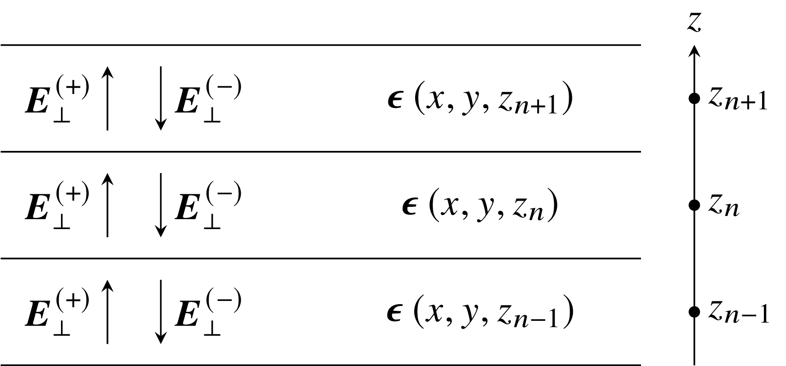

.. _microscopy_model:

Microscopy model for Nemaktis
=============================

We present here the theoretical model of microscopy that is at the core of Nemaktis. A few
interactive graphics are provided in order to better understand important concepts. The
javascript code for these interactive examples can be found in an `ObservableHQ notebook
<https://observablehq.com/@warthan07/microscopy-model-for-nemaktis>`_.

1. General description
-------------------

In a real transmission and/or reflection microscope, objects are imaged using a combination
of lighting systems and lenses. The path of light in such microscopes can always be
decomposed in three steps:

1. Light propagates from the illuminating source to the object through the illumination
   optical setup.

2. Light is transmitted through (or reflected from) the object.

3. Light transmitted or reflected from the object propagates through the microscope
   objective and form an observable image in a target imaging plane.

The case of spectrally-extended lighting (e.g. white light lamp) can be easily covered by
projecting on an appropriate color space the final images formed by the different
wavelengths of the lamp spectrum. In Nemaktis, this is done internally after repeating the
imaging simulations for all the wavelengths in a user-defined array approximating the lamp
spectrum. For more details on the color space projection method, see `Color
conversion <https://dtmm.readthedocs.io/en/latest/tutorial.html#color-conversion>`_ in the
documentation of ``dtmm``, one of the backend used in Nemaktis.  Here, we consider for
simplicity's sake a simple microscopy model based on lighting with a single wavelength. We
describe in the next sections the physical mechanisms behind the three steps introduced
above, as schematized below in a simplified representation of our virtual microscope in
transmission mode:

.. raw:: html

  

    

  

  

2. Koehler illumination setup
--------------------------

The first propagation step is the illumination of the object by the light source. The
standard illumination setup used in most microscopes is called the Koehler illumination
setup (introduced by August Koehler in 1893), and has the advantage of allowing a uniform
lighting even with non-uniform light source. In short, it allows to map each point of the
light source to a single uniform plane wave incident on the object with a certain angle; the
maximum angle of incidence for the plane waves is set by an aperture called the **condenser
aperture**, thus the set of plane waves incident on the object all have wavevectors included
inside a cone of illumination whose opening is set by the condenser aperture. In addition, a
**field aperture** allows to control the size of the lighting spot on the object, but this
feature is irrelevant in Nemaktis since we always assume that the whole computational box
representing the object is illuminated.

In order to better understand how this illumination setup works, an interactive example is
provided below, where the reader can dynamically adjust the sliders for opening/closing the
field and condenser apertures:

.. raw:: html

  

    

    

    

  

  

A correctly assembled Koehler illumination setup has the following properties:

* The field aperture is in the back focal plane of the lamp collector lens.
* The condenser aperture is in the front focal plane of the condenser lens.
* The image of the lamp filament through the lamp collector lens is in the same plane as the
  condenser aperture.
* The image of the field aperture throught the condenser lens is is in the same plane as the
  object.

We emphasize that the lamp filament is always spatially incoherent, thus the different
incident plane waves cannot interfer between themselves. This means that the final image in
the microscope is always obtained by summing-by-intensity the individual images formed by
each incident plane waves. In real life, there is always an infinite number of plane waves
incident on the object, but in the computer one must choose an approximate discrete set of
plane waves. In Nemaktis, the set of incoming plane waves is chosen to have the following
wavevectors (assuming that the third coordinate correspond to the main propagation axis in
the microscope):

.. math::

  \vec{k}^{(k,l)}=k_0\left(\begin{aligned}
    q^{(k)} \cos\theta^{(k,l)} \\ q^{(k)} \sin\theta^{(k,l)} \\ \sqrt{1-\left[q^{(k)}\right]^2}
  \end{aligned}\right)

where we defined :math:`k_0=2\pi/\lambda` with :math:`\lambda` the wavelength in empty space and:

.. math::

  \begin{aligned}
    q^{(k)} &= \frac{k}{N_r-1}\mathrm{NA}_\mathrm{max},\quad\quad k=0\cdot\cdot\cdot N_r-1 \\
    \theta^{(k,l)} &= \frac{\pi l}{3k},\quad\quad\quad\quad\quad\quad l=0\cdot\cdot\cdot 6k
  \end{aligned}

Here, :math:`\mathrm{NA}_\mathrm{max}=\sin\psi_\mathrm{max}` (with :math:`\psi_\mathrm{max}`
the maximal angle of opening of the wavevectors) is the maximal numerical aperture of the
Koehler illumination setup, and :math:`N_r` correspond to the number of discretization steps
in the radial direction. This choice of wavevectors correspond to a standard discretization
of a circular aperture in the transverse plane, which can be interactively visualized by
adjusting the sliders for :math:`N_r` and :math:`\mathrm{NA}`.

.. raw:: html

  

    

    

    

  

  

In Nematkis, this mesh is fully characterized by the two parameters,
:math:`\mathrm{NA}_\mathrm{max}` and :math:`N_r`, and has a total number of points of
:math:`1+3N_r(N_r-1)`. Since this mesh is (weakly) nonuniform, we use a tailored integration
rule to recombine the microscope images in the final imaging plane, which also have the
benefit of being able to dynamically change the numerical aperture of the condenser between
0 and :math:`\mathrm{NA}_\mathrm{max}` in the microscope's user interface.

To conclude this section, we mention the final approximation made in Nemaktis for the
illumination setup: we assume that all the incoming plane waves have the same intensity.
This approximation is probably not true in a real microscope, but has the advantage of
always yielding rotationally invariant images when observing rotationally invariant objects
(e.g. isotropic droplets), as empirically observed in most microscopes. In any case, the
goal of our simple model of Koehler illumination setup for Nematkis is only to provide a
qualitatively correct description of the "smoothing" effect (due to the increasing number of
incident planewaves) of a real microscope when opening the condenser aperture.

3. Transmission/Reflection of light inside the object
-----------------------------------------------------

The next step is the transmission or reflection of light inside the object. In Nemaktis, we
exlude metallic surfaces and metamaterials, and assume that the object is fully transparent
(no absorption), time-invariant (no fluctuations leading to light scattering), and can be
represented by a permittivity tensor field :math:`\epsilon_{ij}(x,y,z)` which is discretized
on a 3D cartesian mesh. The transmission and reflection of light in such objects is modeled
by the well-known wave equation for the time-harmonic Maxwell electric field
:math:`\vec{E}(x,y,z)\exp\left[-ik_0ct\right]` (with :math:`c` the light speed and
:math:`k_0` the wavevector in empty space):

.. math::

  \vec\nabla\times\vec\nabla\times\vec{E}-k_0^2\bar{\bar\epsilon}\vec{E}=0

There exists general schemes for fully solving this equation (most notably the
Finite-Difference-Time-Domain method), but they are computationally very intensive, which is
why we resort to less expansive (but approximate) methods in Nemaktis. More specifically, we
propose three "backends" which allows to propagate the optical fields inside the object and
are described in the following subsections. As a general rule, each backend provides a set
of mappings between each incoming plane waves (see Sec. 2) and output optical fields defined
on the output object plane (see figure in Sec. 1). In the current version of Nemaktis, only
transmitted optical fields are considered as "output", support for reflected fields will
come later.

3.1 The beam-propagation backend (bpm-solver)
.............................................

This backend correspond to a subset of a generalized framework for beam propagation in
general birefringent medium that I developed (see citation below). This generalized
framework relies on a minimal set of physical assumptions (most notably a relatively small
refractive index contrast :math:`\Delta n<0.4` inside the object) and admits two Beam
Propagation Methods (BPM):

- Wide-angle BPM, which can accurately propagate optical fields up to deviation angles of
  20-30°.
- Paraxial BPM, which can accurately propagate optical fields up to deviation angles of
  5-10°. 

The second version of BPM is especially suite for microscopy applications, since in most
microscopes (exluding confocal microscopes with high numerical aperture objective) only the
paraxial components of light contributes to the final image. In our open-source package
Nemaktis, only paraxial BPM is included as a backend for microscopy, but we are open to new
collaborations on our closed-source wide-angle BPM for advanced use (nonlinear optics,
modeling of complex photonics devices, steering of light using birefringent structures...).

At its core, the beam propagation works by decomposing the optical (electric) field
:math:`\vec{E}` in forward and backward propagating fields inside a series of layers
approximating the full permittivity profile :math:`\bar{\bar\epsilon}(x,y,z)`:

The permittivity tensor is assumed to be stepwise constant along :math:`z` (the main axis of
propagation inside the microscope) but is allowed to have arbitrary variations in the
transverse directions :math:`x` and :math:`y`. Our beam propagation framework correspond to
a set of equations allowing to propagate the optical fields inside each layers (including
diffraction and beam walk-off effects due to the nonuniformity of the optical and
permittivity fields) and transfer fields through the discontinuity interface between each
layer. In Nemaktis, we assume smooth variations of the permittivity along :math:`z` and
therefore only propagates forward-propagating fields using the following formula:

.. math::

  \mathbf{E}(z_{n+1})=\mathbf{U}\cdot\mathbf{E}(z_n),

where :math:`\mathbf{E}(z_n)` is a huge vector containing all degree-of-freedoms for the
optical fields in the transverse plane :math:`z=z_n` and :math:`\mathbf{U}` is an evolution
operator which can be written as an easy-to-compute product of exponential of sparse
matrices representing differential operators on 2D meshes. The evolution operator
:math:`\mathbf{U}` is directly derived from Maxwell equations with a few mathematical
assumptions (small index contrast and paraxiality of fields) and can be applied in a very
efficient way (complexity :math:`O(N)`, with :math:`N` the total number of
degree-of-freedoms for the computational mesh).

Since we only take into account forward-propagating fields, reflection microscopy is
currently not supported in Nemaktis, but we hope to implement this feature in the future
since we already derived the associated theoretical framework. Note that internally, each
imaging simulation includes a lot of different paraxial BPM sub-simulation for each incident
plane-wave, source wavelength, and input polarisations. Using the same notation as in
Sec. 2 and assuming a single input wavelength, the incident optical fields for all
these sub-simulations are written as:

.. math::

  \vec{E}^{(k,l,m)}(x,y)=\exp\left\{i\left[x k^{(k,l)}_x+y k^{(k,l)}_y\right]\right\}\vec{u}_m,

where :math:`k` and :math:`l` are the indices for the input wavevector
:math:`\vec{k}^{(k,l)}` and :math:`\vec{u}_m` (:math:`m=1,2`) is an orthogonal basis for the
input polarisation. The use of repeated simulations based on orthogonal polarisations allows
efficient imaging simulations of arbitrary polarized optical micrographs (using polariser,
analyzer, waveplate...), with a dynamic adjustment of the associated parameters (e.g.
polariser and analyzer angle) in the graphical user interface.

Readers interested in our beam propagation framework can read the associated publication:

`[G. Poy and S. Žumer, Optics Express 28, 24327 (2020)]<https://doi.org/10.1364/OE.400984>`_
