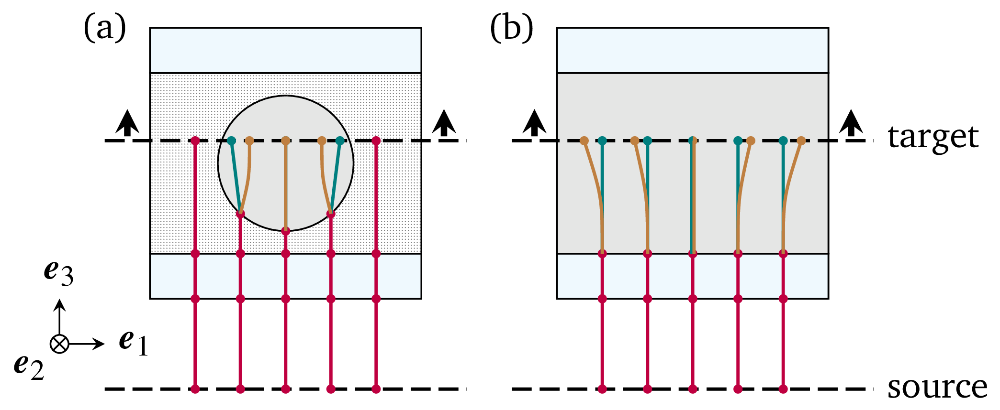
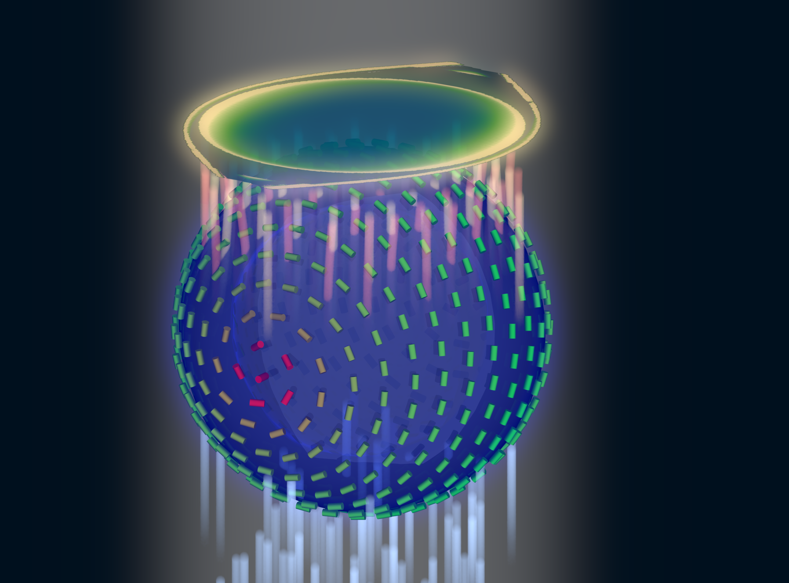

.. _microscopy_model:

Microscopy model for Nemaktis
=============================

We present here the theoretical model of microscopy that is at the core of Nemaktis. A few
interactive graphics are provided in order to better understand important concepts. The
javascript code for these interactive examples can be found in an `ObservableHQ notebook
<https://observablehq.com/@warthan07/microscopy-model-for-nemaktis>`_.

1. General description
-------------------

In a real transmission and/or reflection microscope, objects are imaged using a combination
of lighting systems and lenses. The path of light in such microscopes can always be
decomposed in three steps:

1. Light propagates from the illuminating source to the object through the illumination
   optical setup.

2. Light is transmitted through (or reflected from) the object.

3. Light transmitted or reflected from the object propagates through the microscope
   objective and form an observable image in a target imaging plane.

The case of spectrally-extended lighting (e.g. white light lamp) can be easily covered by
projecting on an appropriate color space the final images formed by the different
wavelengths of the lamp spectrum. In Nemaktis, this is done internally after repeating the
imaging simulations for all the wavelengths in a user-defined array approximating the lamp
spectrum. For more details on the color space projection method, see `Color
conversion <https://dtmm.readthedocs.io/en/latest/tutorial.html#color-conversion>`_ in the
documentation of ``dtmm``, one of the backend used in Nemaktis.  Here, we consider for
simplicity's sake a simple microscopy model based on lighting with a single wavelength. We
describe in the next sections the physical mechanisms behind the three steps introduced
above, as schematized below in a simplified representation of our virtual microscope in
transmission mode:

.. raw:: html
  <link rel="stylesheet" href="https://cdn.jsdelivr.net/npm/@observablehq/inspector@5/dist/inspector.css">
  

    

  

  

We also provide an additional Sec. 5 to explain the modeling of optical elements for
polarized micrographs, which are mostly ignored in Sec. 2-4.

2. Koehler illumination setup
--------------------------

The first propagation step is the illumination of the object by the light source. The
standard illumination setup used in most microscopes is called the Koehler illumination
setup (introduced by August Koehler in 1893), and has the advantage of allowing a uniform
lighting even with non-uniform light source. In short, it allows to map each point of the
light source to a single uniform plane wave incident on the object with a certain angle; the
maximum angle of incidence for the plane waves is set by an aperture called the **condenser
aperture**, thus the set of plane waves incident on the object all have wavevectors included
inside a cone of illumination whose opening is set by the condenser aperture.

In addition, a **field aperture** allows to control the size of the lighting spot on the
object. In practice, the mapping between points on the light source and incident plane waves
is only approximate due the imperfection of the optical elements and the wave nature of
light, especially near the boundary of the lighting spot on the object. However, this is not
a problem in Nemaktis since we always assume that the lighting spot is much bigger than the
typical size of the observed object, thus justifying the representation in terms of incoming
plane waves.

In order to better understand how this illumination setup works, an interactive example is
provided below, where the reader can dynamically adjust the sliders for opening/closing the
field and condenser apertures:

.. raw:: html

  

    

    

    

  

  

A correctly assembled Koehler illumination setup has the following properties:

* The field aperture is in the back focal plane of the lamp collector lens.
* The condenser aperture is in the front focal plane of the condenser lens.
* The image of the lamp filament through the lamp collector lens is in the same plane as the
  condenser aperture.
* The image of the field aperture throught the condenser lens is is in the same plane as the
  object.

We emphasize that the lamp filament is always spatially incoherent, thus the different
incident plane waves cannot interfer between themselves. This means that the final image in
the microscope is always obtained by summing-by-intensity the individual images formed by
each incident plane waves. In real life, there is always an infinite number of plane waves
incident on the object, but in the computer one must choose an approximate discrete set of
plane waves. In Nemaktis, the set of incoming plane waves is chosen to have the following
wavevectors (assuming that the third coordinate correspond to the main propagation axis in
the microscope):

.. math::

  \vec{k}^{(k,l)}=k_0\left(\begin{aligned}
    q^{(k)} \cos\theta^{(k,l)} \\ q^{(k)} \sin\theta^{(k,l)} \\ \sqrt{1-\left[q^{(k)}\right]^2}
  \end{aligned}\right)

where we defined :math:`k_0=2\pi/\lambda` with :math:`\lambda` the wavelength in empty space and:

.. math::

  \begin{aligned}
    q^{(k)} &= \frac{k}{N_r-1}\mathrm{NA}_\mathrm{max},\quad\quad k=0\cdot\cdot\cdot N_r-1 \\
    \theta^{(k,l)} &= \frac{\pi l}{3k},\quad\quad\quad\quad\quad\quad l=0\cdot\cdot\cdot 6k
  \end{aligned}

Here, :math:`\mathrm{NA}_\mathrm{max}=\sin\psi_\mathrm{max}` (with :math:`\psi_\mathrm{max}`
the maximal angle of opening of the wavevectors) is the maximal numerical aperture of the
Koehler illumination setup, and :math:`N_r` correspond to the number of discretization steps
in the radial direction. This choice of wavevectors correspond to a standard discretization
of a circular aperture in the transverse plane, which can be interactively visualized below
by adjusting the sliders for :math:`N_r` and :math:`\mathrm{NA}`.

.. raw:: html

  

    

    

    

  

  

In Nematkis, this mesh is fully characterized by the two parameters,
:math:`\mathrm{NA}_\mathrm{max}` and :math:`N_r`, and has a total number of points of
:math:`1+3N_r(N_r-1)`. Since this mesh is (weakly) nonuniform, we use a tailored integration
rule to recombine the microscope images in the final imaging plane, which also have the
benefit of being able to dynamically change the numerical aperture of the condenser between
0 and :math:`\mathrm{NA}_\mathrm{max}` in the microscope's user interface.

To conclude this section, we mention the final approximation made in Nemaktis for the
illumination setup: we assume that all the incoming plane waves have the same intensity.
This approximation is probably not true in a real microscope, but has the advantage of
always yielding rotationally invariant images when observing rotationally invariant objects
(e.g. isotropic droplets) with natural light, as empirically observed in most microscopes.
In any case, the goal of our simple model of Koehler illumination setup for Nematkis is only
to provide a qualitatively correct description of the "smoothing" effect (due to the
increasing number of incident planewaves) of a real microscope when opening the condenser
aperture.

3. Transmission/Reflection of light inside the object
-----------------------------------------------------

The next step is the transmission or reflection of light inside the object. In Nemaktis, we
exlude metallic surfaces and metamaterials, and assume that the object is fully transparent
(no absorption), time-invariant (no fluctuations leading to light scattering), and can be
represented by a permittivity tensor field :math:`\epsilon_{ij}(x,y,z)` which is discretized
on a 3D cartesian mesh. The transmission and reflection of light in such objects is modeled
by the well-known wave equation for the time-harmonic Maxwell electric field
:math:`\vec{E}(x,y,z)\exp\left[-ik_0ct\right]` (with :math:`c` the light speed and
:math:`k_0` the wavevector in empty space):

.. math::

  \vec\nabla\times\vec\nabla\times\vec{E}-k_0^2\bar{\bar\epsilon}\vec{E}=0

There exists general schemes for fully solving this equation (most notably the
Finite-Difference-Time-Domain method), but they are computationally very intensive, which is
why we resort to less expansive (but approximate) methods in Nemaktis. More specifically, we
propose three "backends" which allows to propagate the optical fields inside the object and
are described in the following subsections. As a general rule, each backend provides a set
of mappings between each incoming plane waves (see Sec. 2) and output optical fields defined
on the output object plane (see figure in Sec. 1). In the current version of Nemaktis, only
transmitted optical fields are considered as "output", support for reflected fields will
come later.

3.1 The beam-propagation backend (bpm-solver)
.............................................

This backend correspond to a subset of a generalized framework for beam propagation in
general birefringent medium that I developed (see citation below). This generalized
framework relies on a minimal set of physical assumptions (most notably a relatively small
refractive index contrast :math:`\Delta n<0.4` inside the object) and admits two Beam
Propagation Methods (BPM):

* Wide-angle BPM, which can accurately propagate optical fields up to deviation angles of
  20-30°.
* Paraxial BPM, which can accurately propagate optical fields up to deviation angles of
  5-10°. 

The second version of BPM is especially suite for microscopy applications, since in most
microscopes (exluding confocal microscopes with high numerical aperture objective) only the
paraxial components of light contributes to the final image. In our open-source package
Nemaktis, only paraxial BPM is included as a backend for microscopy, but we are open to new
collaborations on our closed-source wide-angle BPM for advanced uses (nonlinear optics,
modeling of complex photonics devices, steering of light using birefringent structures...).

At its core, the beam propagation works by decomposing the optical (electric) field
:math:`\vec{E}` into forward and backward propagating fields inside a series of layers
approximating the full permittivity profile :math:`\bar{\bar\epsilon}(x,y,z)`:

The permittivity tensor is assumed to be stepwise constant along :math:`z` (the main axis of
propagation inside the microscope) but is allowed to have arbitrary variations in the
transverse directions :math:`x` and :math:`y`. Our beam propagation framework correspond to
a set of equations allowing to propagate the optical fields inside each layers (including
diffraction and beam walk-off effects due to the nonuniformity of the optical and
permittivity fields) and transfer fields through the discontinuity interface between each
layer. In Nemaktis, we assume smooth variations of the permittivity along :math:`z` and
therefore only propagates forward-propagating fields using the following formula:

.. math::

  \mathbf{E}(z_{n+1})=\mathbf{U}\cdot\mathbf{E}(z_n),

where :math:`\mathbf{E}(z_n)` is a huge vector containing all degree-of-freedoms for the
optical fields in the transverse plane :math:`z=z_n` and :math:`\mathbf{U}` is an evolution
operator which can be written as an easy-to-compute product of exponential of sparse
matrices representing differential operators on 2D meshes. The evolution operator
:math:`\mathbf{U}` is directly derived from Maxwell equations with a few mathematical
assumptions (small index contrast and paraxiality of fields) and can be applied in a very
efficient way (complexity :math:`O(N)`, with :math:`N` the total number of
degree-of-freedoms for the computational mesh).

Since we only take into account forward-propagating fields, reflection microscopy is
currently not supported in Nemaktis, but we hope to implement this feature in the future
since we already derived the associated theoretical framework. Note that internally, each
imaging simulation includes a lot of different paraxial BPM sub-simulations for each incident
plane-wave, source wavelength, and input polarisations. Using the same notation as in
Sec. 2 and assuming a single input wavelength, the incident optical fields for all
these sub-simulations are written as:

.. math::

  \vec{E}^{(k,l,m)}(x,y)=\exp\left\{i\left[x k^{(k,l)}_x+y k^{(k,l)}_y\right]\right\}\vec{u}_m,

where :math:`k` and :math:`l` are the indices for the input wavevector
:math:`\vec{k}^{(k,l)}` and :math:`\vec{u}_m` (:math:`m=1,2`) is an orthogonal basis for the
input polarisation. The use of repeated simulations based on orthogonal polarisations allows
the caching of relevant data for efficiently simulating arbitrary polarized optical
micrographs (using polariser, analyzer, waveplate...), with a dynamic real-time adjustment of the
associated parameters (e.g.  polariser and analyzer angle) in the graphical user interface.

Readers interested in our beam propagation framework can read the associated publication:

`[G. Poy and S. Žumer, Optics Express 28, 24327 (2020)] <https://doi.org/10.1364/OE.400984>`_

3.2 The diffraction transfer matrix backend (dtmm)
..................................................

This backend correspond to a python package originally written by a colleague, Dr. Andrej
Petelin, and that we decided to include in Nemaktis for easy comparison between different
approaches of electromagnetic field propagation. At its core, the diffractive transfer
matrix method (DTMM) of Dr. Petelin is conceptually very close to the beam propagation
backend presented above in Sec. 3.1: the permittivity tensor field representing the
object is also split in a series of birefringent slabs, evolution operators are similarly
used to propagate the fields inside the slabs, and continuity equations are used to transfer
the fields between the layers. The difference between DTMM and our BPM framework mainly lie
in the way that the evolution operators are calculated: in DTMM, this evolution operator is
calculated with a clever heuristic combination of the Berreman method and diffraction
transfer matrix applied in Fourier space. The Berreman method was originally developped for
the calculation of transmitted and reflected light in layered system (permittivity tensor
field independent from :math:`x` and :math:`y`) and neglects diffraction (the redistribution
of optical energy due to non-uniformity of the optical and permittivity fields); in DTMM,
the evolution operators derived by Berreman are combined with a powerful treatment of
diffraction in Fourier space based on local mode grouping, thus allowing to take into
account variations of fields in the :math:`x` and :math:`y` directions.

Since this is a Fourier-based method, its complexity is :math:`O(N\log\left[N/N_z\right])`
with :math:`N` the total number of mesh points and :math:`N_z` the number of layers. It is
also based on a user-defined parameter allowing to define the accuracy of diffraction in the
simulation:

* low value of this parameter provide quick (but inacurate) simulations with faster running
  times than BPM on relatively small meshes (for big meshes, the logarithmic complexity of
  dtmm kicks in and DTMM can be slower than BPM);
* high value of this parameter provide accurate simulations (computational errors similar
  than the ones obtained with BPM) with generally slower running times than with BPM.

In short, DTMM is the perfect backend if you want to quickly try imaging simulations without
worrying too much about the accuracy, whereas BPM is more suited for efficient accurate
simulations on arbitrary big meshes (provided that enough random-access-memory is
available!).

In Nemaktis, DTMM is closely integrated in the high-level python package allowing to run
imaging simulations, but we emphasize that DTMM also has a dedicated python package with
advanced features such as iterative algorithms for the calculation of reflected fields (a
feature which is currently missing in the BPM backend). If you absolutely need these
advanced features, please directly use the python package ``dtmm`` (which is automatically
installed with Nematkis!):

`[DTMM: a Diffractive Transfer Matrix Method] <https://github.com/IJSComplexMatter/dtmm>`_

3.3 The ray-tracing backend (rt-solver)
.......................................

This backend relies on the so-called geometrical optics approximation and works by
decomposing the incoming plane wave in a series of light rays, which are propagated through
the object using Hamiltonian ray-tracing equations. The validity of this method is quite
restricted: the permittivity tensor field :math:`\bar{\bar\epsilon}(x,y,z)` must correspond
to a uniaxial birefringent medium whose optical axis is smoothly varying in space, with
typical variation lengths much bigger than the wavelength of light. It also necessitates
some tweaking in order to correctly reconstruct the optical fields on a cartesian mesh
(since the ray-tracing method only gives optical fields along rays, which can be deflected
by the object).

Since this method cannot be really used as a "blackbox" simulation tool, it is provided as
such (i.e. as a low-level C++ code) without any integration in the easy-to-use high-level
python interface in Nemaktis. Nevertheless, this method can still be useful to get some
physics insight on how light is deflected in particular systems (see for example `[J. Hess,
G. Poy, J.-S. B. Tai, S. Žumer and I. I. Smalyukh, Phys. Rev. X 10, 031042 (2020)]
<https://doi.org/10.1103/PhysRevX.10.031042>`_ or to make attractive scientific
visualizations like the image below (cover of the paper presenting our method, which is
cited below):

Readers interesting with further details on our ray-tracing method can refer to the following publication:

`[G. Poy and S. Žumer, Soft Matter 15, 3659 (2019)] <https://doi.org/10.1039/C8SM02448K>`_

4. Imaging of the object
------------------------

The final step of light propagation inside the microscope is the proper imaging of the
object using the light coming from the object (i.e. the output of the backends presented in
Sec. 3). In a real microscope, this is done by combining an objective with an eyepiece
lens allowing to project on the user's retina the optical fields coming from a plane aligned
inside the object. As a general rule, this system is always associated with two planes: the
**focusing plane** which is roughly aligned with the object, and the **imaging plane** in
which the final image is formed. Since this is a linear optical system, the optical fields
on both planes are always related by a linear transform:

.. math::

  \vec{E}\left[\vec{r}^{\rm (im)}\right] =
    \int \bar{\bar{G}}\left[\vec{r}^{\rm (im)},\vec{r}^{\rm (foc)}\right]
    \vec{E}\left[\vec{r}^{\rm (foc)}\right] {\rm d}^2\vec{r}^{\rm (foc)}
    
where :math:`\vec{r}^{\rm (im)}` (:math:`\vec{r}^{\rm (foc)}`) correspond to coordinates on
the imaging (focusing) plane and :math:`\bar{\bar{G}}` is called the point-spread-function
(PSF) of the imaging system. The actual expression of the PSF depends on the implementation
of the imaging lens, but in general it acts as a low-pass filter because it is
aperture-limited, i.e. one cannot observe details below the diffraction limit (typical width
of a detail smaller than the wavelength). In Nemaktis, we use a very simple model of imaging
system based on a single objective lens and the imaging/focusing planes placed at distance
:math:`2f` on each side of the lens (with :math:`f` the focal length of the objective). We
assume that the objective is an ideal thin-lens, which allows us to obtain a very simple
form of the linear transform above in the transverse Fourier space (see details in [J. W.
Goodman, *Introduction to Fourier optics*, Roberts & Company Publishers (2005)]):

.. math::

  \tilde{\vec{E}}\left[\vec{k}_\perp,z^{\rm (im)}\right] =
    \Pi\left[\frac{\left|\vec{k}_\perp\right|}{2k_0 {\rm NA}}\right]
    \tilde{\vec{E}}\left[\vec{k}_\perp,z^{\rm (foc)}\right]
    
where :math:`\rm NA` is the numerical aperture of the objective, :math:`\Pi` is the
rectangular function (:math:`\Pi(u)` is equal to 1 if :math:`|u|<0.5`, else it it equal to
0), and a tilde indicate a partial Fourier transform along the :math:`x` and :math:`y`
coordinates (associated with a Fourier frequency :math:`\vec{k}_\perp`). Note that this
formula neglects the reversal of the image due to the negative magnification of a single
converging lens; in practice, this can be easily remedied by adding a second lens (as in a
real microscope) or by reversing the axes' orientations in the imaging plane, in which case
the formula above is perfectly valid.

The formula above shows that Fourier components with :math:`\left|\vec{k}_\perp\right|\ge
k_0 {\rm NA}` are filtered out by the objective while Fourier components with
:math:`\left|\vec{k}_\perp\right|<k_0 {\rm NA}` are preserved as such, which indeed
corresponds to a low-pass filter. However, this formula is insufficient to completely model
our imaging system since the **object plane** (which we define as the output plane of the
object, i.e. the output of the backends presented in Sec. 3) can be slightly shifted
with respect to the focusing plane: in a real microscope, this shift is usually controled by
a knob allowing to set the vertical position of the sample with respect to the objective
lens.  Therefore, we need to propagate the fields from the object plane to the focusing
plane before applying the formula above. Since this propagation step happens in free space
with :math:`\epsilon=1`, this can be done by exactly solving Helmoltz equation in Fourier
space:

.. math::

  \tilde{\vec{E}}\left[\vec{k}_\perp,z^{\rm (foc)}\right] =
    \exp\left\{i\left[z^{\rm (foc)}-z^{\rm (obj)}\right]\sqrt{k_0^2-\vec{k}_\perp^2}\right\}
    \tilde{\vec{E}}\left[\vec{k}_\perp,z^{\rm (obj)}\right]
    
The final image on the imaging plane is defined as the squared amplitude of
:math:`\vec{E}\left[\vec{r}^{\rm (im)}\right]`, which can be calculated from the two
formulas above via the Fast-Fourier-Transform algorithm. To get an idea on how the numerical
aperture of the objective and the position of the object plane affect the final image, we
provide a simple interactive example showing how the image of a perfect circular mask is
distorted through the imaging system:

.. raw:: html

  

    

    

    

  

  

5. Optical elements for polarized optical micrographs
-----------------------------------------------------

In Sec. 2-4, we mostly focused on the general principles of microscopy and neglected
the presence of optical elements such as polarisers and waveplates, which play an important
role in polarised optical microscopy. In this section, we introduce the method used in
Nemaktis for taking into account these optical elements in the calculation of the final
images, which are usually called polarised optical micrographs (POM). Nemaktis support two
classes of optical elements for polarised optical microscopy: polarisers/analysers which
allows us to project the light polarisation on a single axis, and waveplates which introduce
a given phase shift between two given orthogonal polarisation axes. The disposition of these
elements in our virtual microscope model is schematized below. In a real microscope, the
exact disposition of these elements may be a bit different (they are often directly embedded
inside the illumination/imaging setups) but we will see in a moment that this does not
change much for the calculation of POMs.

.. raw:: html

  

    

  

  

5.1 Calculation of natural light optical micrographs
....................................................

Let us start with the simplest optical setup possible, without any polarisers or waveplates.
Based on Sec. 2-4, the mapping between incoming plane waves and final optical fields on the
imaging plane may be described with a set of special matrices:

.. math::

  \bar{\bar{T}}^{(k,l)}_{\rm obj} = \left(\begin{aligned}
    \left[P \star \vec{E}^{(k,l,1)}_{\rm out}\right]\cdot\vec{u}_1 \quad
    \left[P \star \vec{E}^{(k,l,2)}_{\rm out}\right]\cdot\vec{u}_1 \\
    \left[P \star \vec{E}^{(k,l,1)}_{\rm out}\right]\cdot\vec{u}_2 \quad
    \left[P \star \vec{E}^{(k,l,2)}_{\rm out}\right]\cdot\vec{u}_2
  \end{aligned}\right),

where :math:`\vec{E}^{(k,l,m)}_{\rm out}` correspond to the output transverse optical field
of one of the backend in Sec. 3 for an incoming plane wave :math:`\vec{E}^{(k,l,m)}_{\rm
in}`, :math:`\vec{u}_m` (:math:`m=1,2`) correspond to an orthogonal basis of polarisations
in the transverse plane, and the operation :math:`P \star` correspond to a convolution with
the linear filter :math:`P` representing the full imaging system, including the
point-spread-function of the objective and the propagation from the output object plane to
the the focusing plane (see Sec. 4).

So why use this complicated representation in terms of matrices? The advantage is that it
allows to easily calculate the final optical fields for an arbitrary input polarisation
:math:`\vec{v}` (not simply :math:`\vec{u}_1` and :math:`\vec{u}_2`) by multiplying the
matrix :math:`\bar{\bar{T}}^{(k,l)}_{\rm obj}` with the vector :math:`\vec{v}`. This is very
similar to the classical Jones calculus, except here the entries of the 2x2 matrices are not
scalars but rather scalar fields (which can depends on the transverse coordinates and can be
submitted to convolution operation including diffraction effects). Note that this
representation is accurate only when the same polarisation basis can be used for all
incoming plane waves. This is true only in the paraxial regime of propagation, where the
longitudinal components of the polarisation can be neglected (second order in the angle
between the wavevector and the main propagation axis :math:`z`). Since we already assumed
paraxial propagation in Sec. 2-4, we can therefore assume that our transfer matrix
representation is consistent and accurate.

We also assume that the illuminating source is unpolarised and that the detector in the
imaging plane is polarisation-independent: it simply measures the squared amplitude of the
transverse optical field. This means that the final image associated with the incoming
wavevector :math:`\vec{k}^{(k,l)}` can be calculated as (up to a constant multiplicative
factor):

.. math::

  I^{(k,l)} = \int_0^{2\pi}\left|\bar{\bar{T}}^{(k,l)}_{\rm obj}
    \left(\begin{aligned}\cos\theta \\ \sin\theta\end{aligned}\right)\right|^2
    \frac{{\rm d}\theta}{\pi}

A direct calculation shows that we do not even need to perform an integration, we can simply sum the squared amplitude of the transfer matrix entries:

.. math::

  I^{(k,l)} = \sum_{m=1}^2\sum_{n=1}^2
    \left|\left[\bar{\bar{T}}^{(k,l)}_{\rm obj}\right]_{mn}\right|^2

5.2 Calculation of polarised optical micrographs
................................................

Now, how do we generalize the calculation of the previous subsection by including any
combination of optical elements for polarised microscopy? Let us introduce the usual Jones
matrices :math:`\bar{\bar{T}}_{\rm pol}`, :math:`\bar{\bar{T}}_{\rm an}` and
:math:`\bar{\bar{T}}_{\rm wp}` respectively associated with a polariser, analyser or
waveplate. The expression of the transfer matrix for a polariser or analyser only depends on
the angle :math:`\psi_{\rm pol,an}` of the optical element axis with respect to
:math:`\vec{u}_1` in the transverse plane (horizontal axis in Nemaktis):

.. math::

  \bar{\bar{T}}_{\rm pol,an} = \begin{bmatrix}
    \cos^2\psi_{\rm pol,an} & \cos\psi_{\rm pol,an}\sin\psi_{\rm pol,an} \\
    \cos\psi_{\rm pol,an}\sin\psi_{\rm pol,an} & \sin^2\psi_{\rm pol,an} \end{bmatrix}

The expression of the transfer matrix for a waveplate depends on the angle :math:`\psi_{\rm
wp}` of the fast axis of the optical element with respect to :math:`\vec{u}_1` and the
phasor :math:`\eta=\exp\left[i\Gamma/2\right]`, with :math:`\Gamma` the retardance of the
waveplate:

.. math::

  \bar{\bar{T}}_{\rm wp} = \begin{bmatrix}
    \eta^*\cos^2\psi_{\rm wp}+\eta\sin^2\psi_{\rm wp} &
      \left(\eta^*-\eta\right)\cos\psi_{\rm wp}\sin\psi_{\rm wp} \\
    \left(\eta^*-\eta\right)\cos\psi_{\rm wp}\sin\psi_{\rm wp} &
      \eta^*\sin^2\psi_{\rm wp}+\eta\cos^2\psi_{\rm wp} \end{bmatrix}

Nemaktis supports three different kinds of waveplates:

* Achromatic quarter-wave plate: :math:`\Gamma=\pi/2` independently of the wavelength;
* Achromatic half-wave plate: :math:`\Gamma=\pi` independently of the wavelength;
* Tint-sensitive full-wave plate: :math:`\Gamma=2\pi\left[0.54/\lambda\right]`, where
  :math:`\lambda` is the wavelength in :math:`\mu{\rm m}`; the advantage of this waveplate
  is that it allows the visualization of in-plane molecular angular deviation as color
  shifts when illuminating an inhomogenenous birefringent sample with white light.

Now that this set of transfer matrices is introduced, the calculation of the final POM
images is really simple:

* Multiply right to left the transfer matrices associated by each elements of the microscope
  in the same order that they are crossed by the illumination beam, and store the result in
  a global transfer matrix :math:`\bar{\bar{T}}^{(k,l)}_{\rm tot}`. For example, if the
  setup includes a polariser, the object, a waveplate and an analyser, the total transfer
  matrix associated with the wavevector :math:`\vec{k}^{(k,l)}` is:

.. math::

  \bar{\bar{T}}^{(k,l)}_{\rm tot} =
    \bar{\bar{T}}_{\rm an} \bar{\bar{T}}_{\rm wp}
    \bar{\bar{T}}^{(k,l)}_{\rm obj}\bar{\bar{T}}_{\rm pol}

* Calculate the final image as in the last subsection by summing the squared amplitude of
  each components of the total transfer matrix:

.. math::

  I^{(k,l)} = \sum_{m=1}^2\sum_{n=1}^2
    \left|\left[\bar{\bar{T}}^{(k,l)}_{\rm tot}\right]_{mn}\right|^2

The validity of our method is again ensured by our assumption of paraxial propagation:

* Since in this regime of propagation the operation :math:`P\star` representing the imaging
  setup is polarisation-independent, it can be commuted with any operation on the
  polarisation state (such as the transfer matrices introduced above); this is why the real
  position of the waveplate and analyser inside the imaging setup of a real microscope do
  not matter in our simple and ideal model of microscopy.
* The transfer matrices of the polariser/analyser and waveplate, as introduced above, do not
  depend on the wavevector of the incoming plane wave, which is not true for wide-angle
  incoming plane waves.
